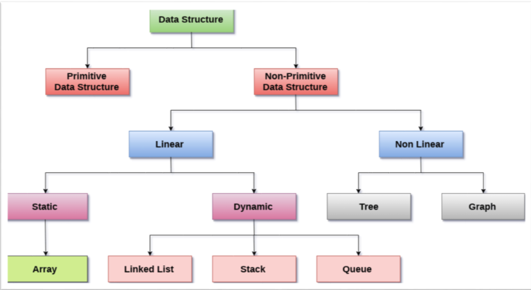

# Data Structures

## PRIMITIVE n Non PRIMITIVE Data structures
Data types are divided into two groups:

- Primitive data types - includes byte, short, int, long, float, double, boolean and char (A primitive data type specifies the size and type of variable values, and it has no additional methods.)
- Non-Primitive Data Types
Non-primitive data types are called reference types because they refer to objects.

### The main difference between primitive and non-primitive data types are:

- Primitive types are predefined (already defined) in Java. Non-primitive types are created by the programmer and is not defined by Java (except for String).
- Non-primitive types can be used to call methods to perform certain operations, while primitive types cannot.
- A primitive type has always a value, while non-primitive types can be null.
- A primitive type starts with a lowercase letter, while non-primitive types starts with an uppercase letter.
